# 🏪 Smart Canteen Project

## 📝 Overview

Smart Canteen is a comprehensive web application designed to automate and improve the canteen experience in educational institutions. It provides a role-based platform for customers, canteen staff, and administrators to manage food orders, inventory, and analytics efficiently. The system supports real-time order updates, secure user authentication, and interactive features like student discounts and a chatbot assistant.

## ✨ Features

### 👤 Customer

* Browse and search the menu  
* Place and track orders with real-time updates  
* Use wallet and apply student discounts  
* Access chatbot assistance  
* View order history and receipts  

### 🍳 Canteen Staff

* Receive and manage orders instantly  
* Update order status (e.g., preparing, ready)  
* Monitor and manage inventory stock  
* View sales and inventory analytics  

### 🛠️ Admin

* Manage users and roles  
* Add, edit, or remove menu items and prices  
* Oversee inventory and stock alerts  
* Analyze sales and customer feedback  
* Configure discounts and promotional offers  

## 🛠️ Technology Stack

### 🌐 Frontend

* React.js with TypeScript  
* Tailwind CSS for styling  
* React Hook Form and Zod for form management and validation  
* Recharts for displaying analytics and charts  

### ⚙️ Backend

* Node.js and Express.js  
* PostgreSQL or MongoDB database options  
* JWT-based authentication for security  
* Socket.IO for real-time communication  

## 📂 Project Structure

```
smart-canteen/
├── client/            # Frontend React app  
│   ├── components/    
│   ├── pages/         
│   └── styles/        
├── server/            # Backend Express app  
│   ├── controllers/   
│   ├── models/        
│   ├── routes/        
│   └── middleware/    
├── docs/              # Documentation and diagrams  
└── README.md          
```

## Installation and Setup

1. Clone the repository:

   ```bash
   git clone https://github.com/yourusername/smart-canteen.git
   cd smart-canteen
   ```

2. Install dependencies:

   ```bash
   cd client
   npm install
   cd ../server
   npm install
   ```

3. Create `.env` files in both `client` and `server` directories with appropriate environment variables, for example:

   ```
   PORT=5000
   DB_URI=your_database_connection_string
   JWT_SECRET=your_jwt_secret_key
   ```

4. Run the development servers:

   ```bash
   # In server directory
   npm run dev

   # In client directory
   npm run dev
   ```

## Future Enhancements

* Mobile app for iOS and Android
* Integration with payment gateways
* AI-powered feedback analysis and personalized recommendations
* Enhanced chatbot with natural language processing
  
## Screenshots
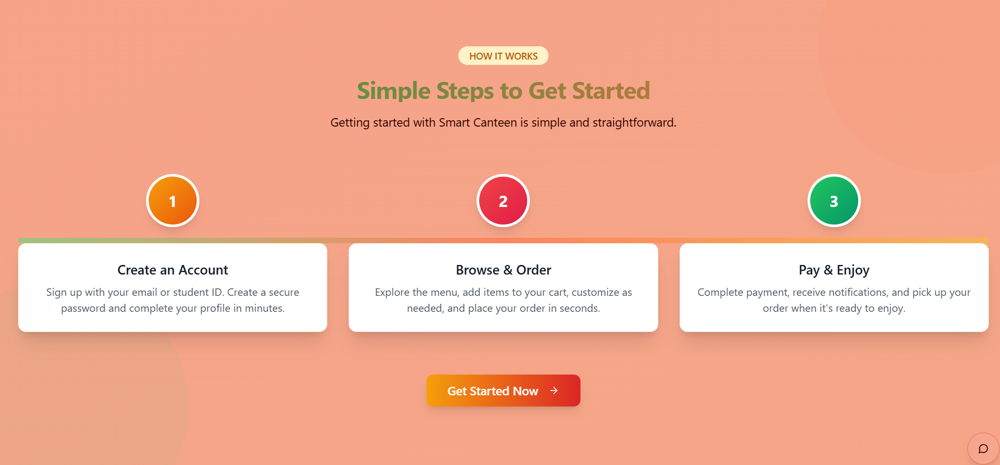
&nbsp;
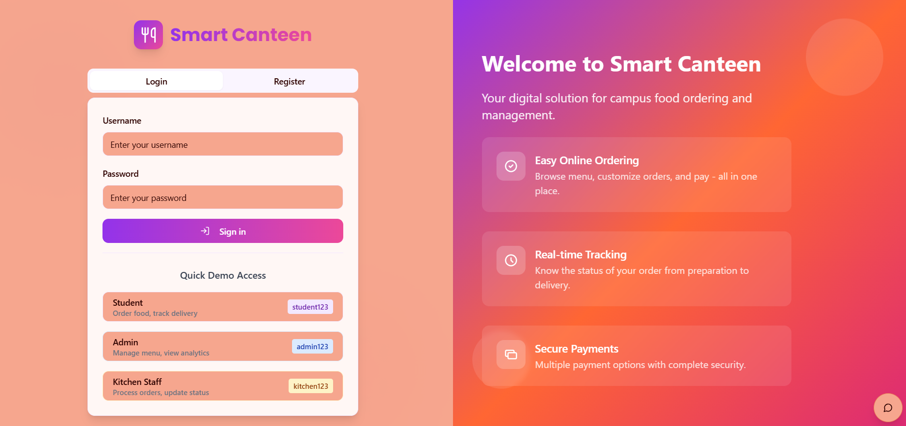
&nbsp;
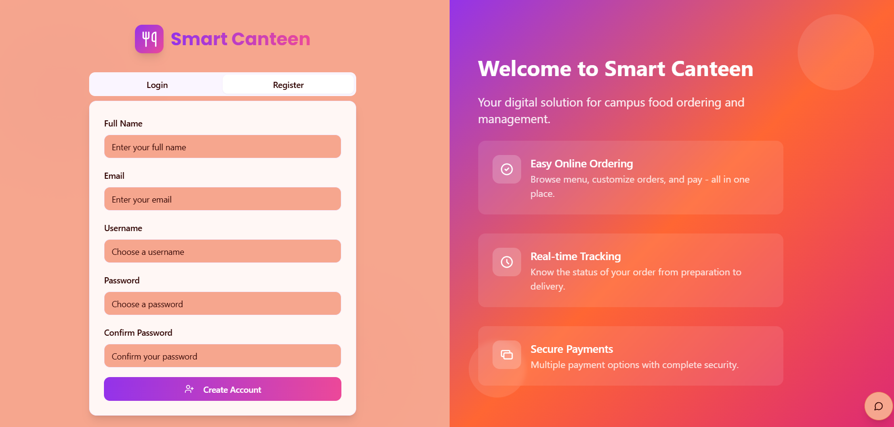
&nbsp;
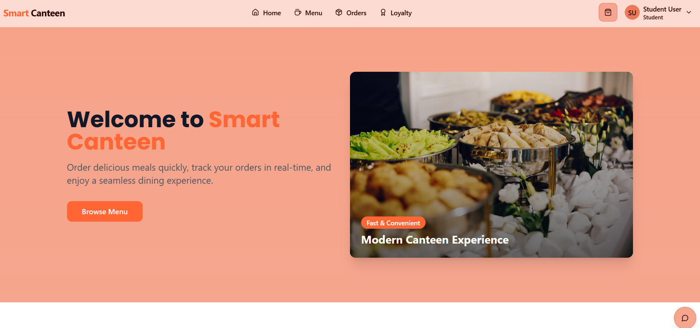
&nbsp;
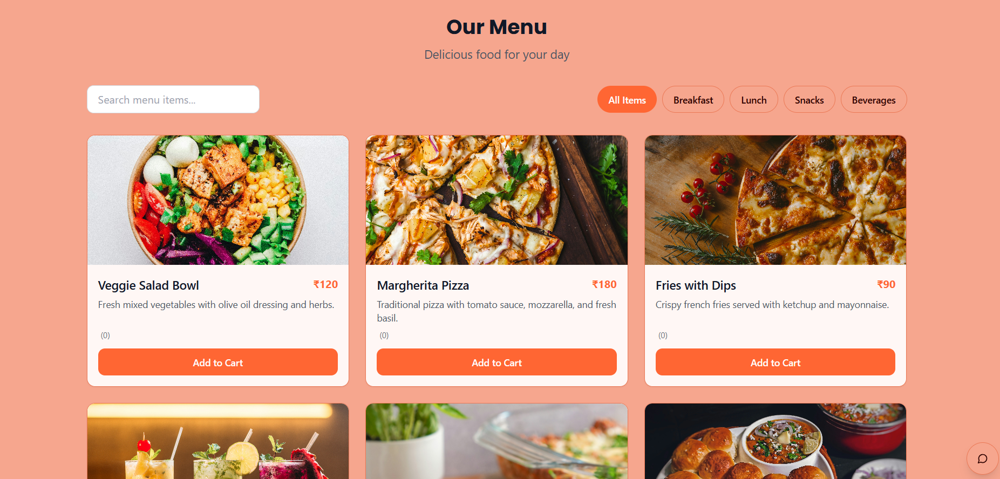
&nbsp;
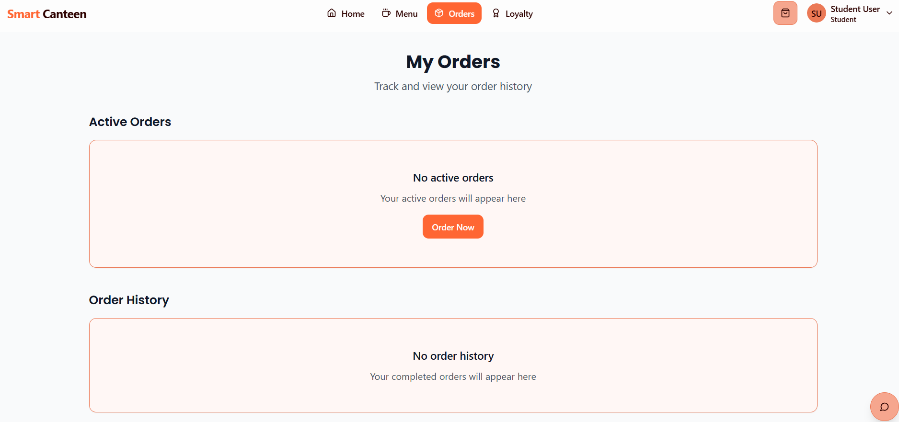
&nbsp;
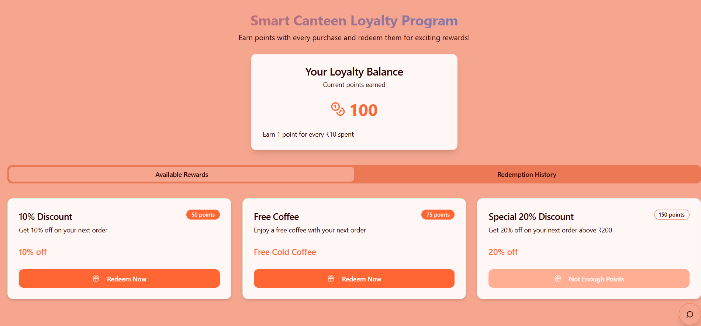
&nbsp;
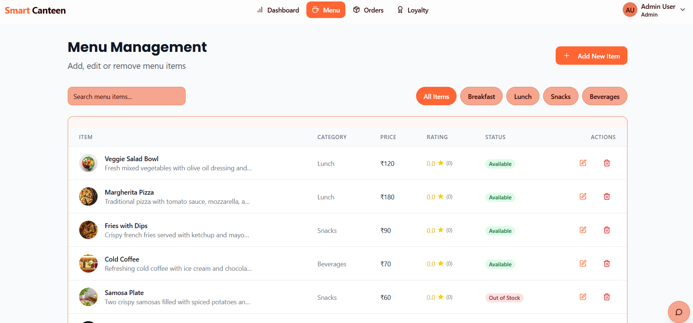
&nbsp;

&nbsp;

&nbsp;

&nbsp;
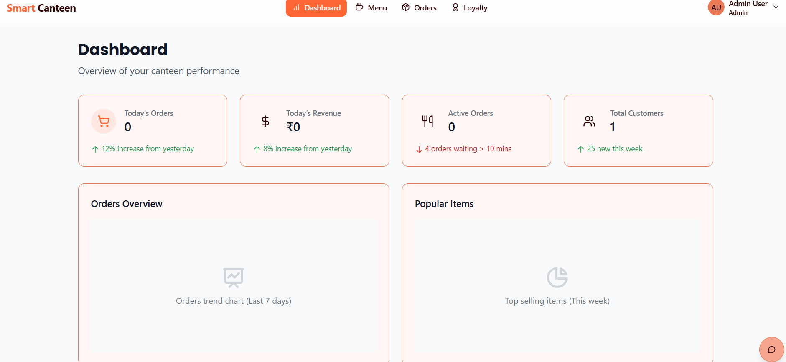
&nbsp;
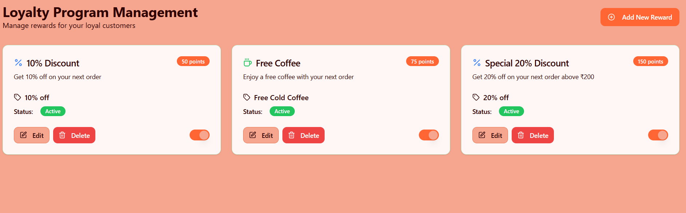
&nbsp;
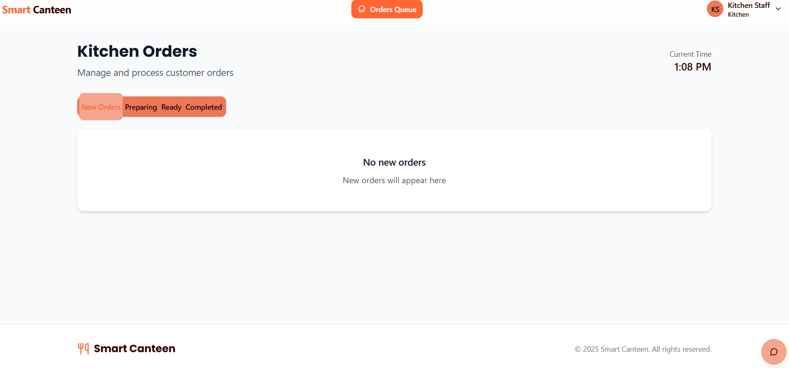
&nbsp;

## Contributing

Contributions are welcome! Please fork the repository, create a feature branch, and submit a pull request for review.


## Author

**Isha Nadargi** — Developer and Project Maintainer

--
